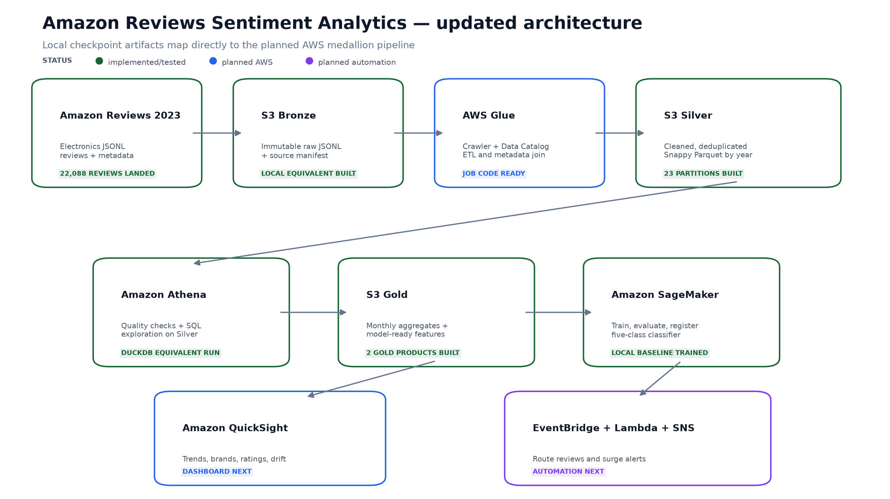
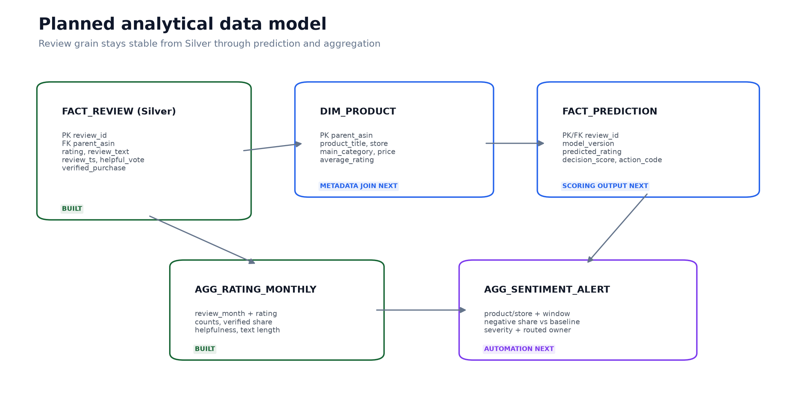

# AWS architecture

The design separates durable storage from temporary compute. S3 and the Glue Data Catalog form the shared data and metadata planes; Glue, Athena, SageMaker, and QuickSight perform specialized work without copying the project into unrelated platforms.

## Data flow

1. **S3 Bronze — immutable source evidence**  
   Seeded review and matched product-metadata samples land as JSONL under separate prefixes. Bronze preserves the source representation so downstream transformations can be repeated.

2. **AWS Glue — validation and transformation**  
   `aws/glue_etl.py` reads only JSONL objects, normalizes types and whitespace, rejects invalid records, creates deterministic review IDs, removes duplicate reviews, joins product metadata, and stops if a review lacks matching product metadata.

3. **S3 Silver — trusted analytical tables**  
   Glue writes `fact_review` partitioned by category and year plus a `dim_product` table. Parquet and Snappy compression reduce Athena scan volume.

4. **Glue Data Catalog — shared schemas**  
   Catalog tables give Athena and downstream services a consistent view of Silver and Gold locations and column definitions.

5. **Athena — validation and Gold construction**  
   SQL checks row counts, nulls, deduplication, product coverage, partitions, and split isolation. CTAS statements create monthly rating metrics, product-month metrics, and model-training data in S3 Gold.

6. **SageMaker — bounded batch training**  
   A single CPU training job reads preassigned train, validation, and test partitions. It writes the trained artifact, metrics, confusion matrix, and held-out predictions back to S3. No persistent inference endpoint is created.

7. **Athena and QuickSight — delivery**  
   Predictions are cataloged and joined to product metadata. QuickSight imports monthly ratings, product metrics, and model-product risk into three SPICE datasets for interactive analysis.

## Data model

The central fact table stores one validated review per `review_id`. `parent_asin` joins reviews to product attributes in `dim_product`. Gold tables aggregate the fact data for the dashboard and isolate user-level model splits.

## Governance controls

- IAM roles are scoped to the project's S3 prefixes and required service actions.
- Athena workgroups force or define project-owned result locations.
- The Gold build workgroup limits each query to 256 MiB scanned.
- The Glue transformation fails when metadata coverage is incomplete.
- A deterministic user hash keeps every reviewer in only one model split.
- SageMaker uses one bounded training instance and no persistent endpoint.
- Evidence is exported before any resource cleanup.
