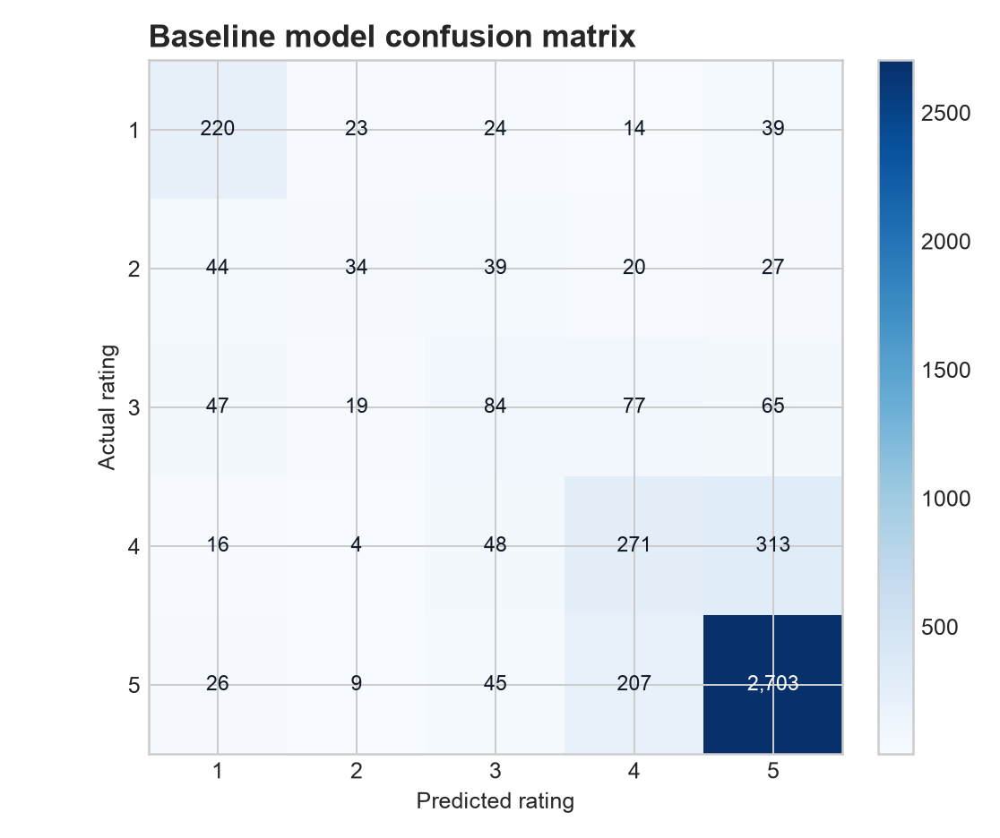
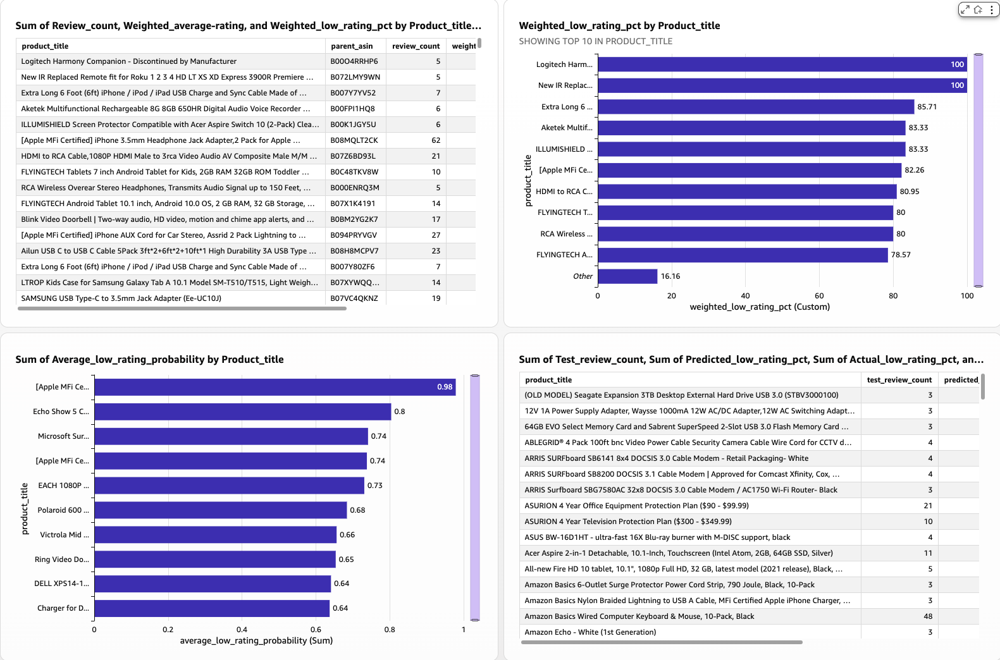

# Results and interpretation

## Dataset profile

The final AWS pipeline validated 66,004 Electronics reviews linked to 39,476 products and 27,359 distinct reviewers. Every review in the implemented sample had matching product metadata. Reviews span 2000–2023, and 92.94% are marked as verified purchases.

The low-rating target is defined as a rating of one or two stars. There are 11,408 low-rated reviews, representing 17.28% of the sample. Because positive reviews dominate, accuracy alone would overstate model quality: a classifier that always predicted the majority class would already achieve 82.19% accuracy.

## Held-out model performance

The test set contains 6,436 reviews from users excluded from training and threshold selection.

| Metric | Result |
|---|---:|
| Accuracy | 93.49% |
| Precision | 78.60% |
| Recall | 87.17% |
| F1 | 82.66% |
| ROC AUC | 97.57% |
| Validation-selected threshold | 0.62 |

The confusion matrix contains 5,018 true negatives, 272 false positives, 147 false negatives, and 999 true positives. Recall of 87.17% means the model identified approximately 87 of every 100 genuinely low-rated reviews in the held-out data. It does not mean that 87% of every predicted alert is correct; that concept is precision, which was 78.60%.

## Business interpretation

The model should rank or flag reviews for human investigation. It can help product and customer-experience teams examine likely low-rating feedback earlier, while the descriptive dashboard shows whether risk is concentrated in specific products or periods.

Very high low-rating percentages for products with only a few reviews should not be interpreted as stable defect rates. Product-level decisions should combine the predicted risk score with review volume, recent trend, verified-purchase status, and the underlying review text.

## Limitations

- The source is a seeded distributed sample, not the complete 22.6 GB review file.
- Text patterns can change over time, requiring temporal validation and drift monitoring.
- Product-level percentages can be unstable at low review counts.
- Review language may reflect category, seller, or customer-population differences not modeled here.
- The classifier predicts a rating proxy; it does not determine root cause or product safety.
- Human review remains necessary before operational action.
